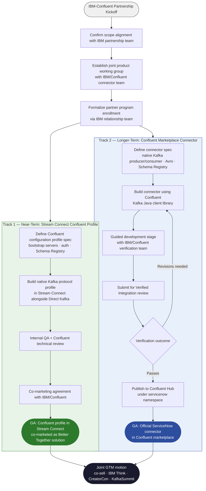

# ServiceNow + IBM/Confluent — Integration Path Flowchart

```mermaid
flowchart TD
    A([IBM-Confluent Partnership Kickoff]) --> B

    B[Confirm scope alignment with IBM partnership team]
    B --> C[Establish joint product working group\nwith IBM/Confluent connector team]
    C --> D[Formalize partner program enrollment\nvia IBM relationship team]

    D --> T1 & T2

    subgraph T1["Track 1 — Near-Term: Stream Connect Confluent Profile"]
        direction TB
        E[Define Confluent configuration profile spec\nbootstrap servers · auth · Schema Registry]
        E --> F[Build native Kafka protocol profile\nin Stream Connect alongside Direct Kafka]
        F --> G[Internal QA + Confluent technical review]
        G --> H[Co-marketing agreement with IBM/Confluent]
        H --> I([GA: Confluent profile in Stream Connect\nco-marketed as Better Together solution])
    end

    subgraph T2["Track 2 — Longer-Term: Confluent Marketplace Connector"]
        direction TB
        J[Define connector spec\nnative Kafka producer/consumer · Avro · Schema Registry]
        J --> K[Build connector using Confluent\nKafka Java client library]
        K --> L[Guided development stage\nwith IBM/Confluent verification team]
        L --> M[Submit for Verified Integration review]
        M --> N{Verification outcome}
        N -->|Passes| O[Publish to Confluent Hub\nunder servicenow namespace]
        N -->|Revisions needed| K
        O --> P([GA: Official ServiceNow connector\nin Confluent marketplace])
    end

    I & P --> Q([Joint GTM motion\nco-sell · IBM Think · CreatorCon · KafkaSummit])

    style T1 fill:#e8f4e8,stroke:#2d7a2d
    style T2 fill:#e8f0fb,stroke:#2d4d9e
    style A fill:#f0f0f0,stroke:#555
    style I fill:#2d7a2d,color:#fff,stroke:#2d7a2d
    style P fill:#2d4d9e,color:#fff,stroke:#2d4d9e
    style Q fill:#1a1a2e,color:#fff,stroke:#1a1a2e
```
